# VMRay Report Phishing Outlook Add-in Deployment Guide

This repository contains the necessary components and instructions to deploy the VMRay Report Phishing Add-in for Outlook. This tool allows users to report suspicious emails directly to a VMRay Incident Response (IR) mailbox for automated  analysis.

---

## Introduction

### Microsoft Outlook Add-ins

Microsoft Outlook Add-ins are web-based extensions that integrate directly into Microsoft Outlook (Desktop, Web, and Mobile). They allow organizations to extend Outlook’s functionality by embedding custom workflows directly inside the mailbox experience.

Using Microsoft 365 Single Sign-On (SSO) and Microsoft Graph API, add-ins can securely interact with user mailbox data without storing credentials, while maintaining enterprise-grade security and compliance.


### About VMRay

VMRay is a leading provider of automated malware analysis and advanced threat detection solutions. Using hypervisor-based sandboxing technology, VMRay delivers deep visibility into sophisticated and evasive cyber threats. 

The **VMRay Report Phishing Outlook Add-in** enables users to:

-   Report suspicious emails with a single click
-   Securely forward the original email (including attachments) to a designated VMRay Incident Response (IR) mailbox
-   Automatically move reported emails to a dedicated Outlook folder
-   Authenticate seamlessly using Microsoft 365 SSO

This add-in streamlines phishing reporting workflows while maintaining security, transparency, and user simplicity.

---


## Prerequisites

* **Azure Subscription:** Required to create the Azure App Registration and host the Azure Web App (middle-tier API).
* **Microsoft 365 Administrator Account :** Required to configure Azure, register the application, grant permissions, and deploy the Outlook add-in within your organization.
* **VMRay IR Mailbox:** A designated email address that will receive reported phishing emails for automated analysis.

---
## Installation Steps

### Phase 1 – Azure App Registration
1. Open [https://portal.azure.com/](https://portal.azure.com) and search `Microsoft Entra ID` service.

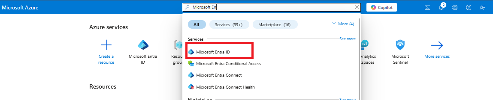

2. Click `Add -> App registration`.

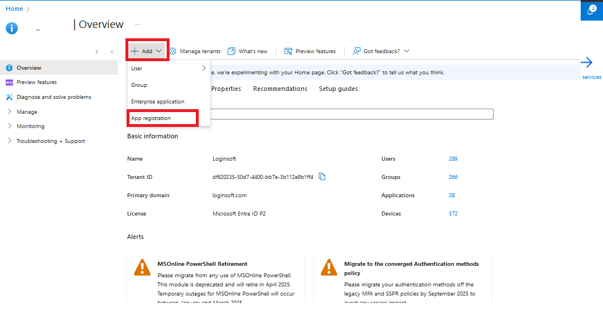

3. Fill:
    * **Name:** ` VMRay-Outlook-Addin-App`
    * **Supported account types:**  Accounts in this organizational directory only
    * **Redirect URI:** Leave blank for now.

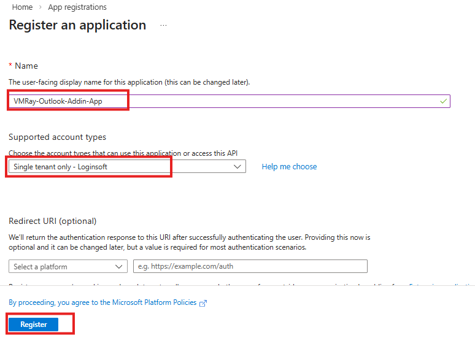

4. Click **Register**

5. From **Overview**, copy:
    * **Application (client) ID**
    * **Directory (tenant) ID**


6. Save these values.
7. Navigate to:**Manage → Certificates & secrets**

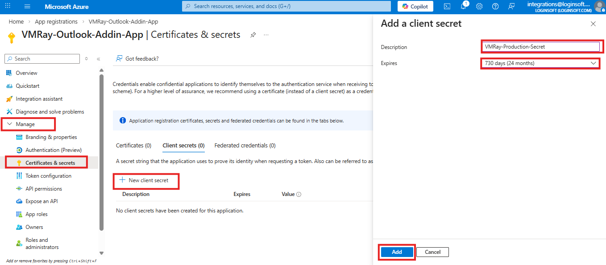

8. Click: **+ New client secret**
9. Enter description and set expiration date for secret. Click **Add**
10. Immediately copy the **Value** of the secret.


Note: You will not be able to view Client Secret after sometime. Save it securely. This will be used in Azure Web App environment variables.

11. Navigate to: **Manage → API permissions**
12. Click **+ Add a permission**
13. Select: **Microsoft Graph**  → **Delegated permissions**. 

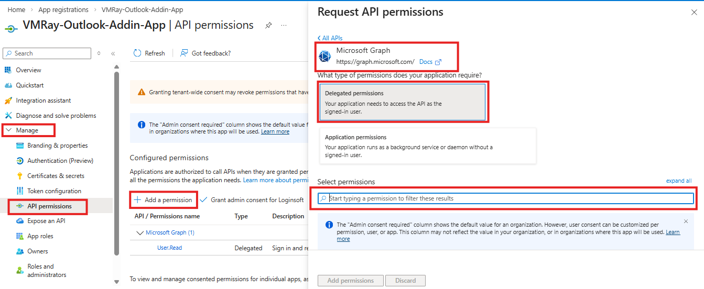

14. Search for below permissions and enable them. Click **Add permissions**

* `Mail.Send`
* `Mail.ReadWrite`
* `User.Read`
* `openid`

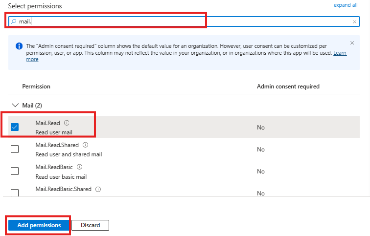

15. Click:   **Grant admin consent for <Your Tenant Name>** and then Confirm.

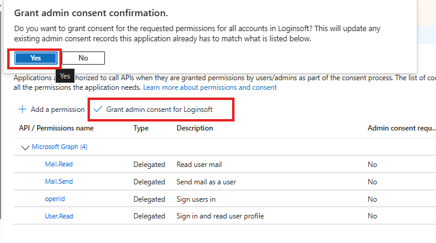

---

### Phase 2 – Deploy Web App

1. Click on below button to deploy:

  [](https://portal.azure.com/#create/Microsoft.Template/uri/https%3A%2F%2Fraw.githubusercontent.com%2Flshaikloginsoft%2FVMRay-Add-in%2Fmain%2FWebApp%2Fazuredeploy.json)

2. On the next page, please provide the values accordingly.

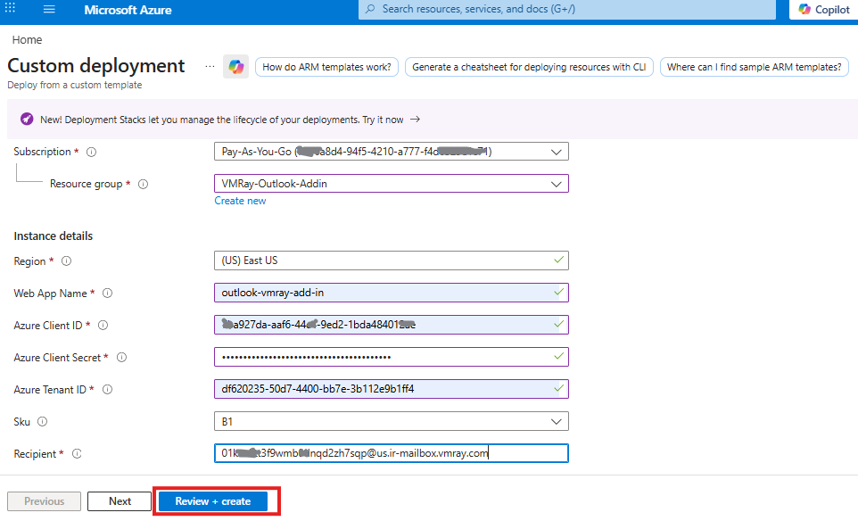


| Fields                                                  | Description                                                                                                                                        |
|:--------------------------------------------------------|:---------------------------------------------------------------------------------------------------------------------------------------------------
| Subscription		                                          | Select the appropriate Azure Subscription                                                                                                          | 
| Resource Group 	                                        | Select the appropriate Resource Group                                                                                                              |
| Region			                                               | Based on Resource Group this will be auto populated                                                                                                |
| Web App Name		                                         | Please provide a web app name                                                                               |
| Azure Client ID                                         | Enter the Azure Client ID created in the App Registration Step                                                                                     |
| Azure Client Secret                                     | Enter the Azure Client Secret created in the App Registration Step                                                                                 |
| Azure Tenant ID                                         | Enter the Azure Tenant ID of the App Registration
| Sku                                         | Select the Azure App Service pricing tier used to host the web application.
| Recipient                                         | Enter email address of the security or incident response mailbox.

3. Once you provide the above values, please click on `Review + create` button.
4. After deployment is successful, expand deployment details and click on your webapp. 
5. In Overview, copy the `Default domain` value from the overview section. This is referred as `domain` in later steps.

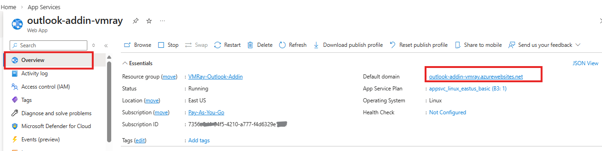

6. Navigate to `Settings → Environment Variables` and click on `+ Add`
7. Fill `name` as `APP_DOMAIN` and value as above copied `Domain` value. Click `Apply`

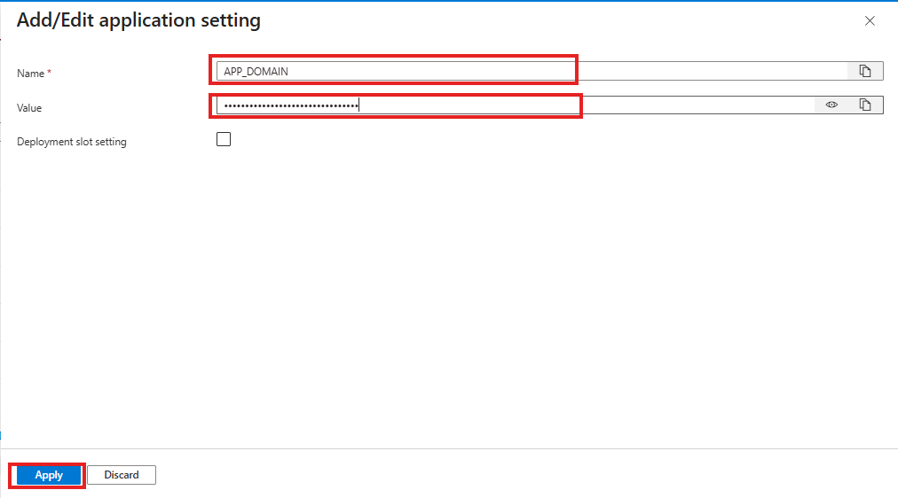

8. Click `Apply` and `Confirm` 
---

## Phase 3 – Configure App Registration 

1. Open App registration and Navigate to: **Manage → Authentication**
2. Click: **+ Add Redirect URI → Single Page Application**
3. Select:  **Single-page application**

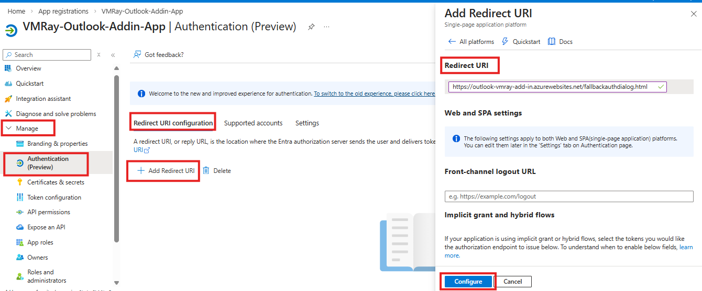

4. Add Redirect URI:
```
https://YOUR-DOMAIN/fallbackauthdialog.html
```
5. Click **Configure** and **Cancel**
6. Navigate to: **Manage → Expose an API**

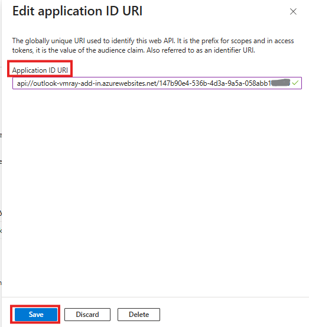

7. Click **Add** (next to Application ID URI)

* Edit manually and add domain after `api://` like below:
```
api://YOUR-DOMAIN/CLIENT_ID
```
8. Click **Save** and copy above Application ID URI for later.
9. Click **+ Add a scope**

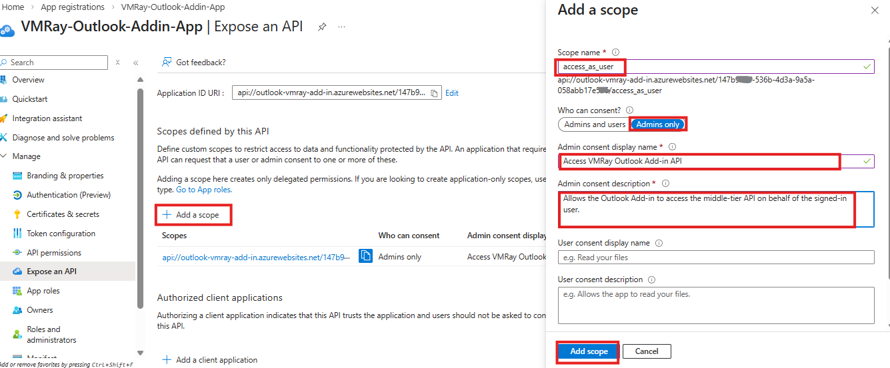

10. Fill:
    * **Scope name:** `access_as_user`
    * **Who can consent:** Admins Only
    * **Admin consent display name:** `Access VMRay Outlook Add-in API`
    * **Admin consent description:** `Allows the Outlook Add-in to access the middle-tier API on behalf of the signed-in user.`
    * **State:** `Enabled`

11. Click **Add scope**
12. Scroll down to **Authorized client applications**
13. Click:  **+ Add a client application**

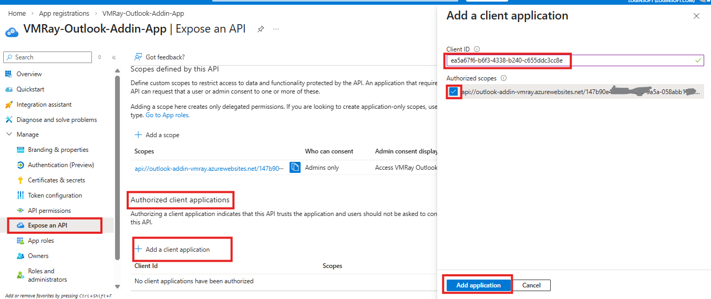

14. In **Client ID**, enter:

   ```
   ea5a67f6-b6f3-4338-b240-c655ddc3cc8e
   ```

   This value pre-authorizes all Microsoft Office application endpoints.

15. Under **Authorized scopes**, enable checkbox:
   ```
   access_as_user
   ```
16. Click **Add application**
---

# Phase 4 – Update manifest.xml

* Open `manifest.xml` file and replace `{YOUR_DOMAIN}` with your Web App domain.

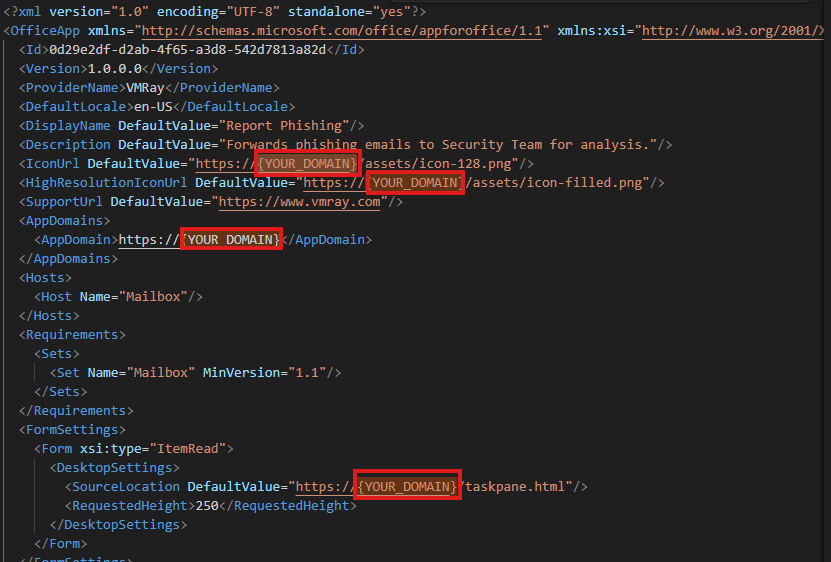

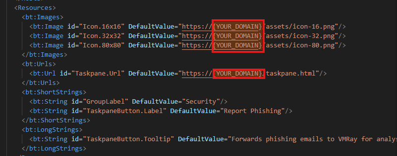

* #### For Example Replace below 

    ```xml
    <IconUrl DefaultValue="https://yourdomain.azurewebsites.net/assets/icon-128.png"/>
    ```
* #### With Replace AppDomain
```xml
    <IconUrl DefaultValue="https://outlook-addin-vmray.azurewebsites.net/assets/icon-128.png"/>
```
* #### Next update `WebApplicationInfo` section with 
    `Client_Id` and `Application ID URI`  value created in Phase 3 step 8

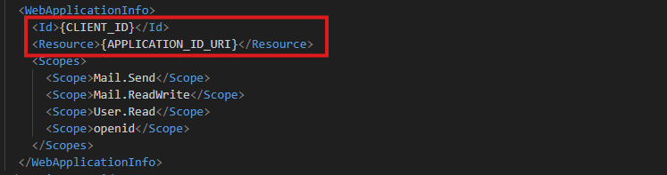

#### Optional: Customize Display Text
1. You may optionally update the values inside the following elements to match your organization’s terminology:

* `<DisplayName>`
* `<Description>`
* `GroupLabel`
* `TaskpaneButton.Label`
* `TaskpaneButton.Tooltip`
2. You can replace them with your name or preferred branding.
3. Save the file.

---

## Phase 5 – Deploy the Add-in via Microsoft 365 Admin Center

1. Go to the **Microsoft 365 Admin Center**
   [https://admin.microsoft.com](https://admin.microsoft.com)
2. Sign in with a **Global Administrator** oaccount.
3. From the left navigation menu, select: **Settings → Integrated apps**

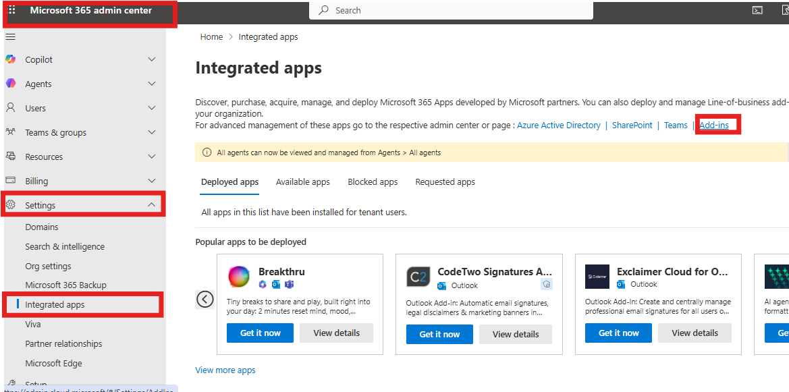

4. Select the **Add-ins** tab at the top.

5. Click **Deploy Add-in**.


6. In the **Deploy a new add-in** wizard, click **Next**.

7. Choose:  **Upload custom apps**


8. Click **Choose File**.

9. Browse to your project and select:

   ```
   manifest.xml
   ```


10. Click **Upload**.

11. Choose who should receive the add-in:

    * **Everyone** – Deploys the add-in to all users in the organization (use only if required).
    * **Specific users/groups** – Deploys to selected users or groups; group-based assignment automatically updates when members are added or removed.
    * **Just me** – Deploys only to your account; recommended for initial testing before organization-wide rollout.

    * Click **Deploy** to complete the assignment.

    * Click **Deploy**.


12.  Confirmation of the admin Consent by clicking on save.


13.  A green checkmark appears when deployment succeeds.

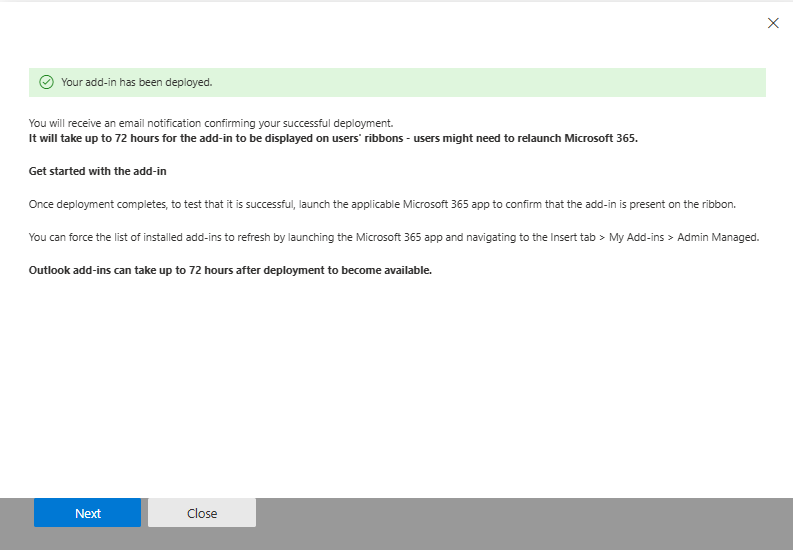

14.  Click **Next** to finish.


15.  If you deployed only to yourself and later want broader rollout:

 > Return to Integrated Apps → Select the add-in → Change user assignment.

Note: Deployment may take up to 72 hours. Users may need to:
* Restart Outlook
* Refresh Outlook on the Web
----

## Phase 6 – Verification
After deployment, the add-in behavior depends on the deployment method selected in the Microsoft 365 Admin Center.

#### If you selected:

**A) Fixed Deployment or Available Deployment**

* Open **Outlook Web or Desktop**.
* Open any email.

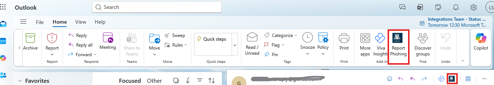

* The add-in should appear automatically in the **top-right action bar** of the message window.
* Click the add-in icon to launch the task pane.

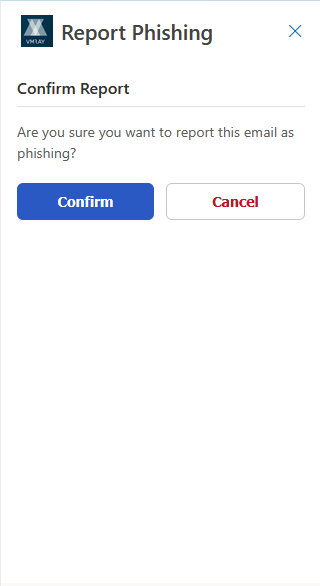

**B) Optional Deployment**

* Open **Outlook**.
* Click the **Apps** icon and click **Get Add-ins**.
* Locate the add-in under **Admin-managed add-ins**.
* Click **Add** to install the add-in for your account.
* Open any email  and click the add-in icon to launch it.


## Post-Deployment Validation Checklist

* Outlook Add-in is visible in Web/Desktop clients
* SSO authentication works without errors
* Reporting a sample email forwards it to **RECIPIENT**
* Task pane messages appear correctly
* Web App `/health` endpoint returns `{"status":"OK"}`
